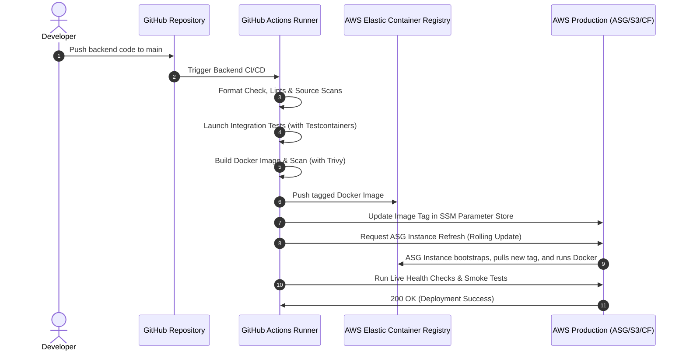

# StartTech System Architecture & Design

This document details the architectural blueprint, security posture, data flow, and deployment workflow for StartTech's full-stack ToDo application.

---

## System Architecture Diagram

The system employs a multi-tiered architecture structured across public and private AWS network boundaries.

```mermaid
graph TB
    subgraph Internet ["Public Internet"]
        User["User Browser"]
    end

    subgraph CDN ["CDN Content Delivery"]
        CF["CloudFront Distribution"]
    end

    subgraph AWS ["Amazon Web Services (AWS) VPC"]
        subgraph PublicSubnets ["Public Subnets (AZ-A, AZ-B)"]
            ALB["Application Load Balancer (ALB)"]
            Bastion["Bastion EC2 Host"]
        end

        subgraph PrivateSubnets ["Private Subnets (AZ-A, AZ-B)"]
            subgraph ASG ["Auto Scaling Group"]
                EC2_A["Backend Instance (AZ-A)"]
                EC2_B["Backend Instance (AZ-B)"]
            end
            
            Redis["ElastiCache Redis"]
            Mongo["MongoDB EC2 Server"]
        end
        
        S3["Frontend S3 Bucket"]
        SSM["SSM Parameter Store"]
        ECR["Elastic Container Registry"]
    end

    %% Routing Flow
    User -->|HTTPS static assets| CF
    CF -->|Fetch Assets (OAC)| S3
    User -->|REST API Requests| ALB
    ALB -->|Forward to port 8080| EC2_A
    ALB -->|Forward to port 8080| EC2_B
    
    %% Compute Connections
    EC2_A -->|Read/Write 27017| Mongo
    EC2_B -->|Read/Write 27017| Mongo
    EC2_A -->|Cache Sessions 6379| Redis
    EC2_B -->|Cache Sessions 6379| Redis
    
    %% Management & Configuration
    Bastion -->|SSH 22| Mongo
    Bastion -->|SSH 22| EC2_A
    Bastion -->|SSH 22| EC2_B
    
    EC2_A -.->|Fetch Parameters| SSM
    EC2_B -.->|Fetch Parameters| SSM
    EC2_A -.->|Pull Docker Image| ECR
    EC2_B -.->|Pull Docker Image| ECR
```

---

## Deployment & CI/CD Workflow

The development lifecycles are completely decoupled. The frontend and backend repositories trigger separate validation and delivery runs:



---

## Security Boundaries & Risk Mitigation

1. **Network Separation**:
   - Only the ALB and the Bastion Host live in the public subnets. They act as ingress controllers.
   - The Go Backend instances, MongoDB instance, and Redis cluster are placed inside private subnets and have *no direct internet visibility*.
2. **Strict Security Groups**:
   - The ALB security group only allows ingress HTTP (80) and HTTPS (443) traffic.
   - The Backend security group only permits ingress traffic on port `8080` from the ALB security group, and SSH (22) from the Bastion.
   - MongoDB and Redis security groups are locked down to accept connections *only* from the Backend security group.
3. **Secrets Management**:
   - DB passwords, API session keys, and encryption secrets are stored in **AWS Systems Manager (SSM) Parameter Store** using `SecureString` encryption.
   - EC2 instances utilize an **IAM Instance Profile** with narrow permissions to pull these variables at boot time, eliminating the need to commit secrets to source code.

---

## Caching Strategy & Static Assets

- **Frontend Distribution**: The React static single-page application is cached globally on the Edge locations of CloudFront. When deployments run, an invalidation command (`aws cloudfront create-invalidation`) clears the cache so customers see new features immediately.
- **Backend Cache**: A Redis instance caches relational queries, task items, and session tokens. The application utilizes a write-through / Cache-Aside hybrid strategy to optimize response latency and minimize MongoDB load.
